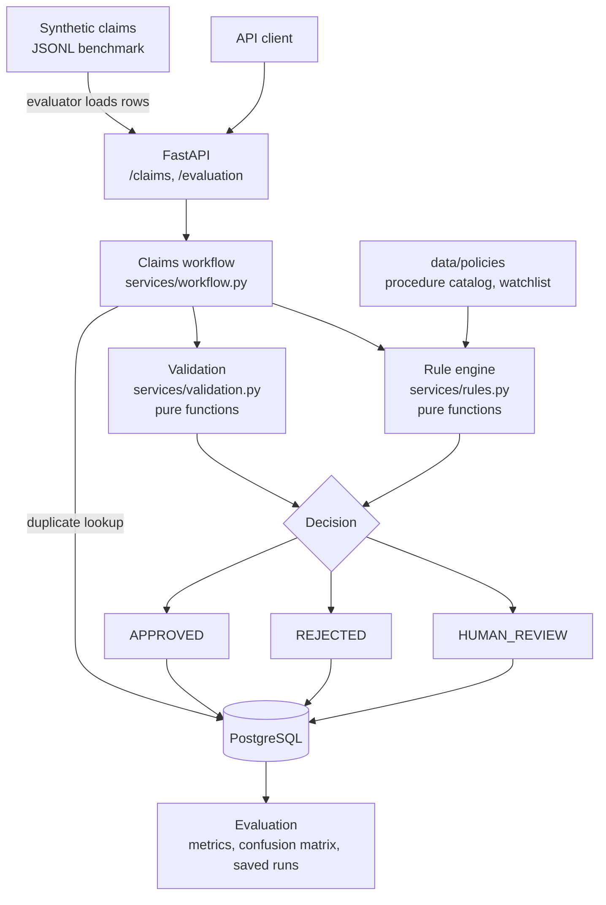
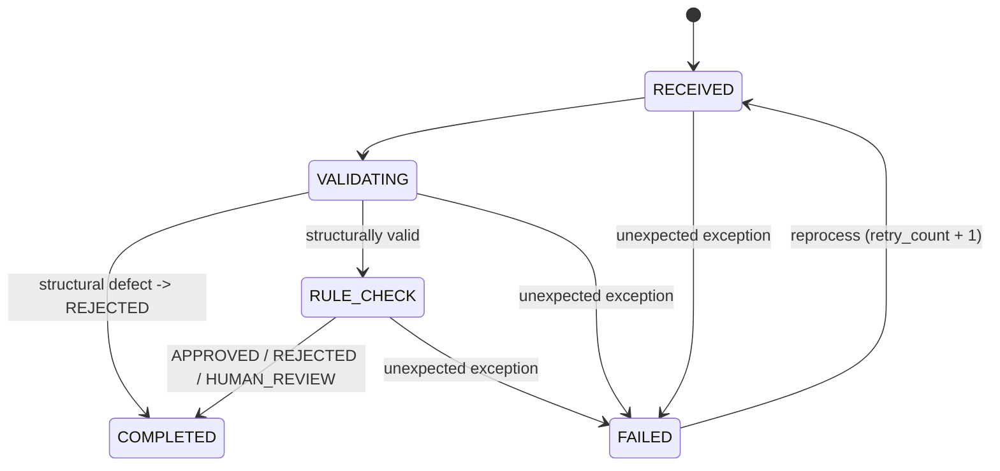

# ClaimFlow architecture (Phase 1: deterministic baseline)

## System diagram

## Workflow states

`COMPLETED` means the workflow ran to a decision (any of the three outcomes). `FAILED` means the software
broke (exception), which is distinct from a claim being rejected. The evaluation reports both separately.

## Layers and responsibilities

| Layer | Path | Rule |
|---|---|---|
| API | `backend/app/api/` | HTTP concerns only: parsing, status codes, calling services. No business rules. |
| Schemas | `backend/app/schemas/` | Pydantic request/response shapes. |
| Business rules | `backend/app/services/validation.py`, `rules.py` | **Pure functions** (claim in, `Decision` out). No DB, no I/O, trivially unit-testable. |
| Workflow | `backend/app/services/workflow.py` | Orchestrates states, does the one DB lookup (duplicates), persists decisions. |
| Policy data | `data/policies/*.json` | Procedure catalog and provider watchlist, loaded by `services/policies.py`. |
| Persistence | `backend/app/models/`, `db/` | SQLAlchemy models: `Claim`, `WorkflowRun`, `EvaluationRun`. |
| Evaluation | `backend/app/evaluation/` | Generator, metrics (pure), evaluator, report formatting, CLI. |

## Key design decisions

1. **Rules return a `Decision`, the workflow persists it.** Keeping I/O out of the rules makes each rule a
   plain function that can be tested with one line, and gives later phases a clean seam: an LLM step can
   return the same `Decision` type.
2. **Lenient intake, strict workflow.** `POST /claims` accepts malformed claims. A claim with a missing
   procedure code is still a claim that must be processed and rejected with a reason, so it is data, not a
   400 error.
3. **First matching rule wins, in a fixed order.** Hard rejections (structural, duplicate, incompatibility)
   run before human-review triggers (policy, cost, notes), and approval is the fallback. The order is visible
   in `evaluate_business_rules`.
4. **Duplicate = same patient + provider + procedure + date, earlier `id` wins.** Using the id, not the
   processing order, makes the result independent of the order claims are processed in.
5. **Benchmark isolation.** Claims from an evaluation run are tagged with `evaluation_run_id`; duplicate
   detection is scoped to that tag. Runs are repeatable and never pollute live claims (`GET /claims` hides
   them by default).
6. **`WorkflowRun` is built for later phases.** `details` (JSON), `decision_explanation`, `engine_version`
   and `retry_count` are there so RAG citations, model names, token usage and retries can be recorded
   without a schema change.
7. **`EvaluationRun` stores the full report plus the dataset SHA-256**, so any two runs (baseline vs RAG vs
   LLM) can be compared and it is provable they used the same data.
8. **Tables are created with `create_all`, not migrations.** Fine for a Phase 1 MVP; Alembic is the first
   thing to add before real deployment.

## What Phase 2+ plugs into

- An LLM/RAG step slots in at `RULE_CHECK` for the cases the rules cannot judge (currently: keyword-based
  ambiguity detection), returning a `Decision` with a confidence and citations in `WorkflowRun.details`.
- The evaluation harness is unchanged: point it at the same dataset with a new `--label` and compare runs.
