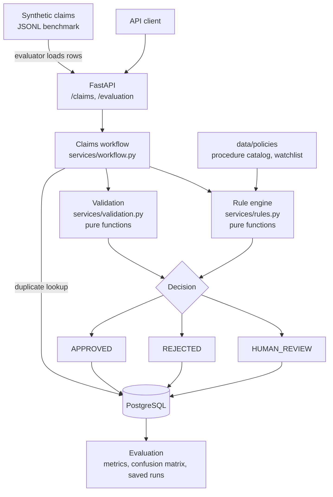
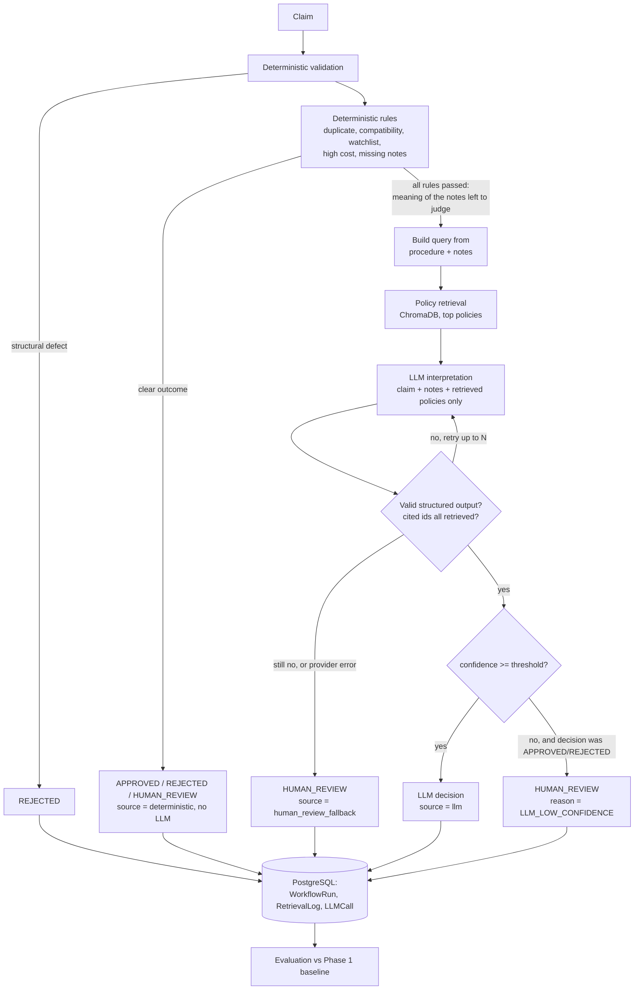

# ClaimFlow architecture

All data is synthetic. ClaimFlow is a portfolio project, not a clinical decision system and not a
compliance-certified product; it makes no HIPAA claims.

## Phase 1: deterministic workflow

## Phase 2: RAG + LLM only where rules cannot decide

Workflow states: `RECEIVED -> VALIDATING -> RULE_CHECK -> [INTERPRETING] -> COMPLETED`, or `FAILED` on an
unexpected exception. `INTERPRETING` is visited only when the LLM path is taken. `COMPLETED` means a decision was
reached (including a human-review fallback); `FAILED` means the software itself broke.

## Layers

| Layer | Path | Rule |
|---|---|---|
| API | `backend/app/api/` | HTTP only. No business rules, no retrieval logic. |
| Business rules | `services/validation.py`, `services/rules.py` | Pure functions: claim in, `Decision` out. |
| Workflow | `services/workflow.py` | Orchestrates states; the only place decisions are persisted. |
| Interpretation | `services/interpretation.py` | Retrieval + LLM + confidence policy. Never raises: failures become `HUMAN_REVIEW`. |
| LLM | `services/llm/` | `base.py` (interface), `anthropic_provider.py`, `openai_provider.py`, `schemas.py` (structured output), `prompts.py`, `structured.py` (validation, grounding, bounded retries). |
| RAG | `app/rag/` | `documents.py`, `chunking.py`, `embeddings.py`, `store.py` (ChromaDB), `retrieval.py`, `config.py` (presets), `ingest.py`. |
| Policy data | `data/policies/` | `procedure_catalog.json` and `provider_watchlist.json` (rules); `documents/*.json` (RAG knowledge base). |
| Evaluation | `app/evaluation/` | Phase 1: generator, `metrics.py`, `evaluator.py`. Phase 2: `retrieval_metrics.py`, `retrieval_eval.py`, `phase2_metrics.py`, `thresholds.py`, `comparison.py`, `run_retrieval.py`, `run_phase2.py`. |

## Key design decisions

1. **The LLM is consulted only after every deterministic rule has passed.** Rejections, duplicates, high-cost,
   watchlist, special procedures and missing notes never reach it (a test asserts zero provider calls for each).
   On the benchmark that is 94 of 200 claims (47%); the other 106 are decided by code alone.
   The trigger is structural (all rules passed), not derived from what the hard cases look like.
2. **Grounding is enforced in code, not requested in the prompt.** A cited policy id that is not in the retrieved
   context makes the response invalid: it is retried with feedback, and if it persists the claim goes to a human.
   The unsupported-citation rate is measured, not assumed to be zero.
3. **Escalation is the safe default.** Any provider error, timeout, malformed output, invalid citation, empty
   retrieval or retrieval error becomes `HUMAN_REVIEW` with a recorded reason. An LLM `HUMAN_REVIEW` answer is
   always accepted; only auto-decisions (`APPROVED`/`REJECTED`) must clear the confidence threshold.
4. **Bounded retries.** At most `1 + LLM_MAX_RETRIES` calls per claim. Transient errors (timeout, connection,
   429, 5xx) and invalid outputs are retried with exponential backoff; permanent errors (bad key, bad request,
   refusal) are not. The SDK's own silent retries are disabled so every call is counted.
5. **Threshold experiments are replayed offline.** The raw LLM answer and confidence are stored with each claim, and
   the threshold rule (`apply_confidence_policy`) is one shared pure function, so re-applying the run's own
   threshold reproduces its outcomes exactly (tested). Several thresholds cost one LLM run, not one per threshold.
6. **Provider abstraction.** The workflow depends on `LLMProvider.complete()` only. Adapters translate vendor SDK
   errors into `TransientLLMError` / `PermanentLLMError`. Structured output is JSON in the reply, validated with
   Pydantic, which works with any provider.
7. **No reasoning is stored.** The model is asked for a decision, confidence, reason code, at most two sentences of
   summary and cited ids. Extra fields are dropped by the schema.
8. **Benchmark isolation and identity.** Phase 2 runs the identical benchmark file as Phase 1. The comparison code
   refuses to compare runs whose dataset SHA-256 or size differ. Retrieval labels are a sidecar file so the
   dataset hash is untouched.
9. **Persistence for Phase 2 adds tables, not columns.** `retrieval_logs` and `llm_calls` are new tables (one row per
   retrieval / per LLM call), and summary fields live in the existing `WorkflowRun.details` JSON. `create_all` creates
   new tables but cannot alter existing ones, so this works on a Phase 1 database without a migration. The trade-off:
   fields such as `decision_source` are queryable in JSON but are not real columns; promoting them needs Alembic.

## WorkflowRun observability

`WorkflowRun.details` (JSON) always contains `states`, `llm_used` and `decision_source`
(`deterministic` | `llm` | `human_review_fallback`). When the LLM path ran it also contains:

| Key | Content |
|---|---|
| `fallback_reason` | `low_confidence`, `provider_error`, `invalid_output`, `invalid_citation`, `retrieval_error`, `no_policy_context` |
| `confidence_threshold`, `keyword_baseline_outcome` | threshold in force; what the Phase 1 keyword check would have said |
| `retrieval` | config, query, chunk ids and scores, policy ids and scores, `context_policy_ids`, `latency_ms` |
| `llm` | provider, model, `calls`, `retries`, `latency_ms`, tokens, `valid`, `failure`, raw decision / reason / confidence, cited ids, unsupported citations, per-attempt outcomes |

`WorkflowRun.latency_ms` is the total (rules + retrieval + LLM). Per-retrieval and per-call rows are in
`retrieval_logs` and `llm_calls`, e.g. `SELECT outcome, count(*) FROM llm_calls GROUP BY outcome`.
